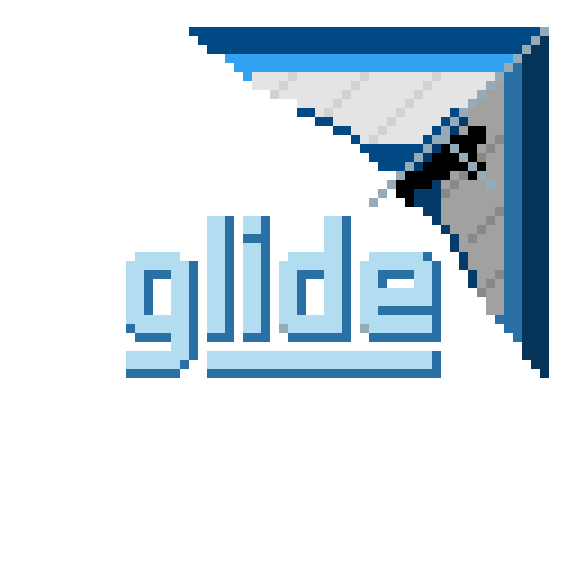
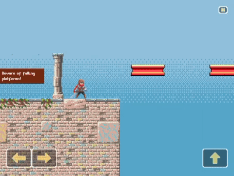
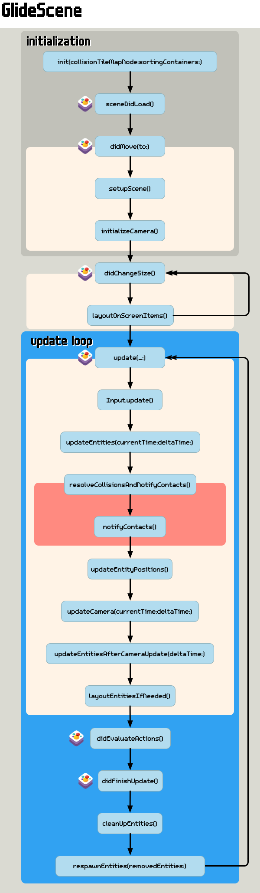
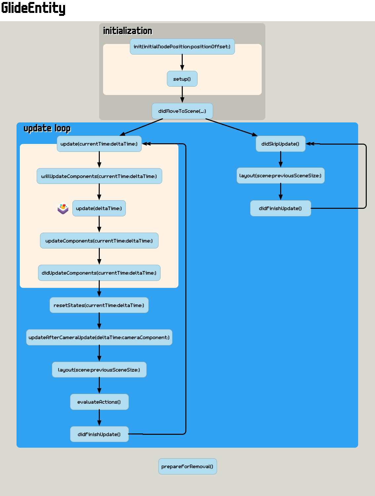

    

# glide engine

glide is a SpriteKit and GameplayKit based engine for building 2d games easily, with a focus on side scrollers. glide is developed with Swift and works on iOS, macOS and tvOS. 

	

	
    
    
    
    

    

## What is in glide?

### 1. Entity component system
glide is developed with Entity-Component-System architecture. In short, this makes it easy to manage the code of your game. Loads of building components common to 2d platformers that will get you quickly started is also included in the engine. 

#### See all the components [here](Docs/Components.md). 👾

### 2. Tight collisions and contacts
glide has its own collision and contact algorithms which is more suitable for precise platformer mechanics compared to using SpriteKit's physicsBody.

### 3. Input 🎮⌨️🖱🔲
Support for Bluetooth and USB game controllers, keyboard, mouse, and touch controls comes out of the box with glide and it is pretty intuitive to use them.

### 4. Native game menus

    

You can't imagine a game without menus in most cases. A UIKit / AppKit based user interface library for making game menus is included in glide, so you don't have to give up from native Apple components in your games. Of course, those menus are controllable via game controllers on iOS, macOS and tvOS 🎮💃

### 5. Audio and music 🔊
There is currently a work in progress for playing audio and music with ready made components in glide. In the mean time, you can go ahead and use `SKAudioNode`s directly with your entities and components as glide is seamlessly integrated with SpriteKit.

## Get your hands on glide

### Demo scenes
glide comes with a fullly fledged demo project. Download this repository and run it in your favorite platform. Running on release configuration with a real device is recommended for experiencing the actual performance.

### Quick start guide
Create your first scene with your first entity [here.](Docs/QuickStartGuide.md)

### Update loops
Here are the update loop charts of glide that you might need as a handy reference.

Scene update loop       |  Entity update loop     |  Component update loop
:-------------------------:|:-------------------------:|:-------------------------:
  |    |  

### Game genres
Supporting other types of 2d games(e.g. top down) with glide is totally possible. However, that is not tested with enough demos yet, and side scrollers are the initial focus for the engine. Please feel free to contribute with your own demos and changes to glide for supporting other games.

### Credits:

- Animated Pixel Adventurer: https://rvros.itch.io/animated-pixel-hero
- Classical ruin tiles: https://opengameart.org/content/classical-ruin-tiles
- [All credits](Docs/AssetCredits.md)
